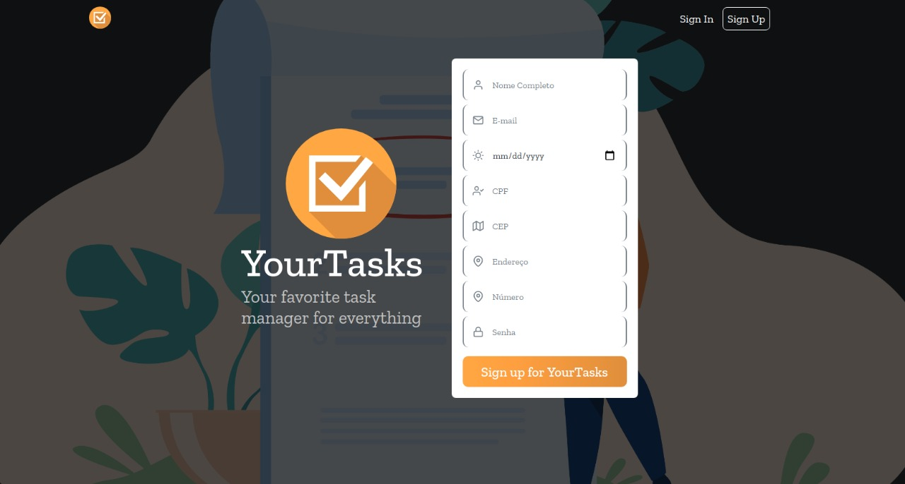
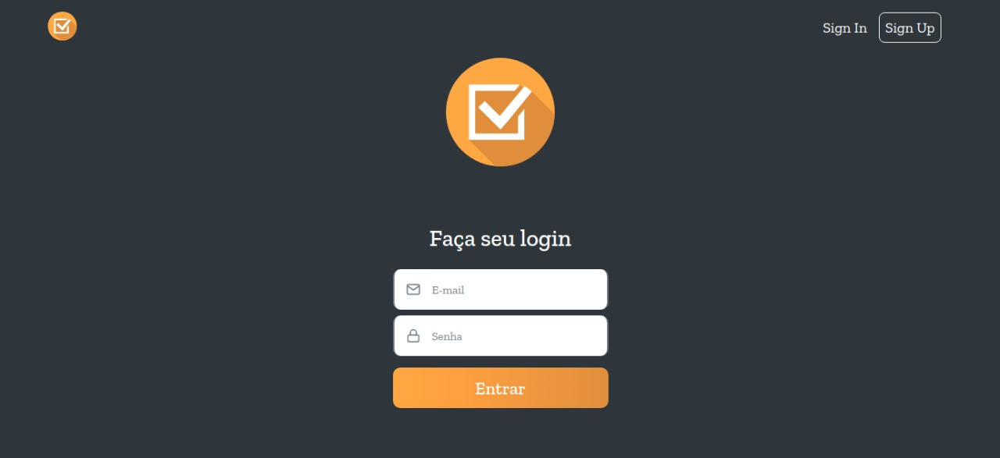
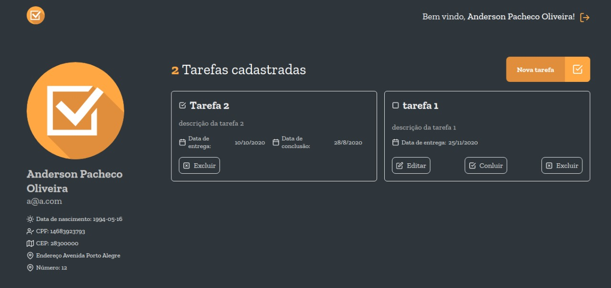
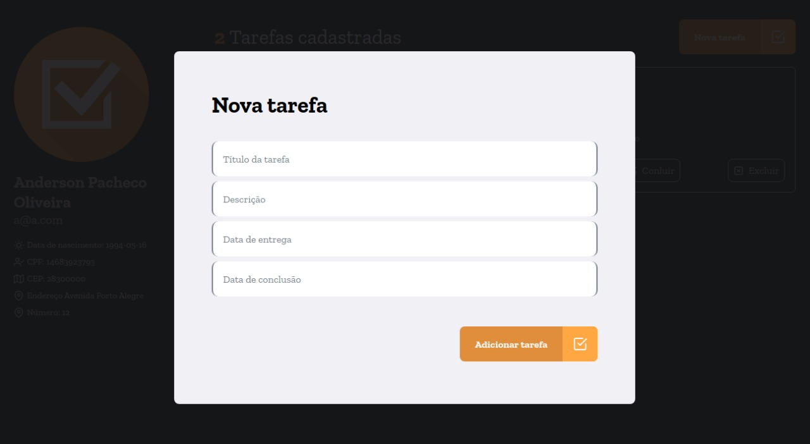

<div align="center">
    
</div>

<h4 align="center">
	Your Tasks
</h4>
<p align="center">
  Your favorite task manager
</p>
<p align="center">


  <a href="https://www.linkedin.com/in/pachecowebdev/">
    
  </a>


</p>

## Projeto

Este teste é composto pela construção de um sistema para gerenciamento de tarefas

## Tecnologias obrigatórias

- [x] React
- [x] Redux
- [x] Redux persist

## Home Page
<div align="center">
    
</div>

## Login
<div align="center">
    
</div>

### Dashboard
<div align="center">
    
</div>

## Nova Tarefa
<div align="center">
    
</div>

## Concluir Tarefa
<div align="center">
    
</div>


## :hammer: Tecnologias

Este projeto foi desenvolvido com as seguintes Ferramentas:

- [TypeScript][typescript]
- [React][reactjs]
- [Redux][redux]
- [Redux Saga][reduxsaga]
- [Styled Components][sc]
- [Yup][yup]
- [VS Code][vs]

## Requisitos

### Home page igual a página do github

- [x] navbar com botão de entrar ou nome do usuário se estiver logado;
- [x] form de cadastro por cima do banner com fundo branco;
- [x] form de cadastro deve possuir os campos (nome, email, data de nascimento, cpf, cep, end-reço, numero, senha);
- [x] os campos nome, email, data de nascimento e senha são obrigatórios os outros são opc-onais;
- [x] apenas usuários maiores de 12 anos podem se cadastrar;
- [x] deve existir validação de CPF;
- [x] o CEP deve ser validado e possuir autocomplete de endereço;

### Após logar no sistema

- [x] deve exibir uma listagem de tarefas cadastradas;
- [x] deve possuir um botão para cadastro de novas tarefas;
- [x] cada registro da listagem deve possuir as ações (editar, excluir, visualizar, concluir)
- [x] a ação de concluir deve ser apenas para tarefas em aberto (não finalizadas), deve solicitar confirmação para concluir uma
tarefa;
- [x] o cadastro de tarefa deve possuir os campos (nome, data de entrega, data de conclusão);
- [x] os campos nome e data de entrega são obrigatórios;
- [x] cada usuário logado deve visualizar apenas as suas tarefas;
- [x] Todos os dados devem ser persistidos no storage do browser;

### Extras

- [ ] Testes unitários dos componentes
- [x] React Hooks

## 🚀 Como rodar este projeto

Para clonar e executar este aplicativo, você precisará de [Git](https://git-scm.com), [Node.js][nodejs] Instalado em seu computador.

### :cyclone: Clonando o repositório

```bash
# Clone este repositório
$ git clone https://github.com/PachecoWebDev/task-manager

# Acesse a pasta do projeto no terminal/cmd
$ cd task-manager
```

### 🧭 Rodando a aplicação web (Front End)

```bash

# Instale as dependências
$ npm install

#or
$ yarn

# Execute a aplicação
$ npm run start

#or
$ yarn start

# A aplicação será aberta na porta:3000 - acesse http://localhost:3000
```

## 🤔 Como contribuir para o projeto

- Faça um **fork** do projeto;
- Crie uma nova branch com as suas alterações: `git checkout -b my-feature`
- Salve as alterações e crie uma mensagem de commit contando o que você fez:`git commit -m "feature: My new feature"`
- Envie as suas alterações: `git push origin my-feature`

> Caso tenha alguma dúvida confira este [guia de como contribuir no GitHub](https://github.com/firstcontributions/first-contributions)


Att. Anderson Pacheco 👨‍💻  [Vamos conversar!](https://www.linkedin.com/in/anderson-pacheco-oliveira-506474a1)

[nodejs]: https://nodejs.org/
[typescript]: https://www.typescriptlang.org/
[sc]: https://styled-components.com/
[reactjs]: https://reactjs.org
[backend]: https://owncloud.mngs.com.br/index.php/s/9wnUxvxe6rTavEU
[vs]: https://code.visualstudio.com/
[yup]: https://github.com/jquense/yup
[redux]: https://redux.js.org/
[reduxsaga]: https://redux-saga.js.org/
